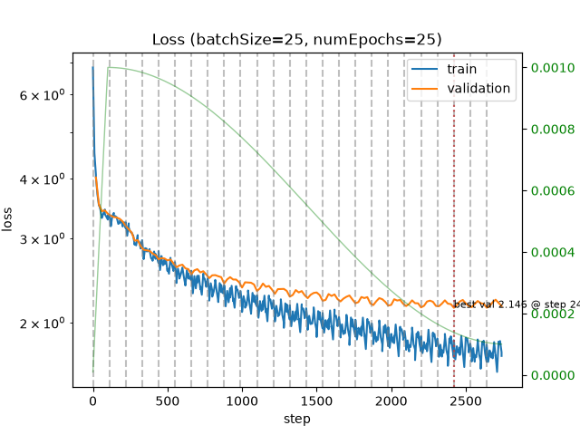
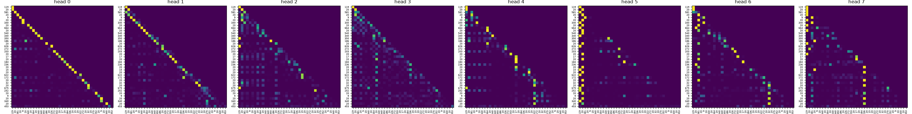

# mini-gpt

A GPT built from scratch in Python/PyTorch, byte-level BPE tokeniser, decoder-only transformer, pretraining, supervised fine-tuning, LoRA, KV-cached inference, and a deployed API. Every component is written by hand rather than pulled from a library.

**Live demo:** https://storyteller-1051990688087.europe-west2.run.app/docs

## Try it

The model is deployed on Cloud Run. Open `/docs` above for an interactive form, or:

```bash
curl -X POST https://storyteller-1051990688087.europe-west2.run.app/generate \
  -H 'Content-Type: application/json' \
  -d '{"prompt":"Write a story about a dragon who loves cake.","maxTokens":100,"temperature":0.7,"k":10}'
```

```json
{
  "text": "Write a story about a dragon who loves cake.\n\nStory:\nOnce upon a time, there was a little girl named Lily. She loved to play with her toys and eat yummy food. One day, she found",
  "promptTokens": 33,
  "truncated": false,
  "contextLimit": 256
}
```

| field | meaning |
| --- | --- |
| `prompt` | The instruction. The delimiter the model was fine-tuned on is appended server-side, so write an instruction rather than story text. |
| `maxTokens` | 1–256, default 100. Roughly 38 ms/token on a Cloud Run vCPU, so 100 tokens ≈ 4 s. |
| `temperature` | > 0, default 1.0. Lower is more deterministic; 0.4 gives coherent stories, 1.0 wanders. |
| `k` | Top-k sampling width, default 10. |

`GET /health` reports the loaded checkpoint, device, parameter count and context limit.

## The model

29.4M parameters — `dModel=512`, 8 layers, 8 heads, `dFF=2048`, `maxLen=256`, vocab 8258.

Pretrained on TinyStories (2.2 GB ≈ 1.08B tokens at the tokeniser's measured 2.06 bytes/token), then instruction-tuned on 98 hand-written examples.

| | |
| --- | --- |
| Validation loss | **2.146** after 590M tokens |
| Random-guess baseline | `ln(8258)` = 9.02 |
| Verbatim 5-gram overlap with training corpus | 0/46 sampled |

## Results

**Pretraining.** Log-scale y-axis, so convergence stays visible rather than being dwarfed by the initial spike.



**Attention.** One sentence's weights across all heads, snapshotted at the end of training.



**KV-cached inference.** Generating 100 tokens from a 20-token prompt, single CPU thread:

| | time | per token |
| --- | --- | --- |
| Full recomputation each step | 1.81 s | 18.1 ms |
| KV cache | 0.66 s | 6.6 ms |

**2.7×**, and the gap widens with sequence length — cached decode is flat in the context length where recomputation is linear in it. Correctness is enforced by a test asserting the cached path matches full recomputation to `1e-5` at *every* decode step, not just the last.

**LoRA.** Rank-8 adapters on all 48 `nn.Linear` layers: **589,824 trainable parameters, 1.99% of the model.** `B` is initialised to zero so the adapter is a no-op at init; `mergeLoRA` folds `W += scale·B@A` back into plain `Linear` layers so the result loads into an ordinary `GPT`.

## Layout

| | |
| --- | --- |
| `tokeniser/` | Byte-level BPE, GPT-2 style. `preprocessor.py` splits raw text and maps bytes to safe printable Unicode; `trainer.py` learns merges greedily by frequency; `bpe.py` applies them via a doubly linked list and min-heap, memoised per word. |
| `transformer/` | Embeddings, multi-head attention, feedforward, layer norm, residuals, stacked into a decoder-only GPT. `train.py` pretrains, `generate.py` does KV-cached autoregressive sampling, `kvcache.py` holds the per-layer key/value store, `memmapsampler.py` streams training windows from a flat `uint16` file. |
| `sft/` | Supervised fine-tuning. `sftutils.py` formats and masks examples so loss is only taken on the response, `sft.py` runs the loop, `lora/` implements LoRA injection and merging. |
| `server/` | FastAPI service — validated request models, model loaded once at startup, per-request KV cache. |
| `traininglogger/` | JSON-lines loss logging and matplotlib visualisation. |
| `datastructures/` | Doubly linked list node used by the BPE encoder to merge symbols in place. |
| `test/` | Tokeniser round-trips, transformer shape and causal-masking tests, KV cache equivalence, training and generation smoke tests. |

## Running locally

```bash
python3 -m venv venv
source venv/bin/activate
pip install -r requirements.txt
```

**Generate from a checkpoint:**

```bash
python main.py "Once upon a time" trained_model/serve.pt --maxTokens 100
```

**Tests:**

```bash
./venv/bin/python -m pytest test/ -q
```

**Supervised fine-tuning** (full fine-tune or LoRA, switched by `useLoRA` in `sft/runsft.py`):

```bash
./venv/bin/python -m sft.runsft
```

**The API:**

```bash
./venv/bin/uvicorn server.app:app --reload
```

Run everything from the project root — `python sft/foo.py` puts `sft/` on `sys.path` instead of the repo root, so use `python -m sft.foo`.